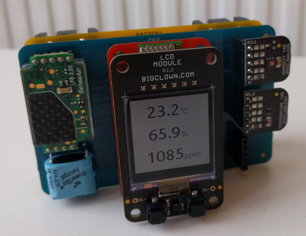

# Firmware for BigClown Room Air Quality Monitor

## Hardware

The following hardware components are used for this project:

* **[Humidity Tag](https://shop.bigclown.com/products/humidity-tag)**
* **[Temperature Tag](https://shop.bigclown.com/products/temperature-tag)**
* **[LCD Module - BG](https://shop.bigclown.com/products/lcd-module)**
* **[Core Module](https://shop.bigclown.com/products/core-module)**
* **[CO2 Module](https://shop.bigclown.com/products/co2-module)**
* **[Battery Module](https://shop.bigclown.com/products/battery-module)**

## Buttons on LCD Module

* Both buttons are wired to boot button on Core Module, so they have same functionality:
  * Press to send event over radio
  * Hold to activate CO2 Module calibration

## License

This project is licensed under the [MIT License](https://opensource.org/licenses/MIT/) - see the [LICENSE](LICENSE) file for details.

---

Made with &#x2764;&nbsp; by [**HARDWARIO s.r.o.**](https://www.hardwario.com/) in the heart of Europe.
